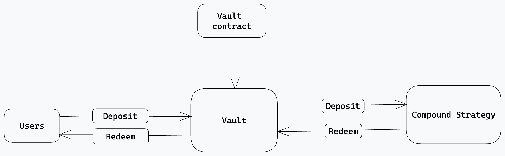

## Yield Farm

####Project: Yield Farm
####Author: Marvellous Ahiara

### Overview:

A Flexible, minimalist, and gas-optimized yield farm protocol for earning interest on ERC20 tokens through Compound Finace.
Users deposit token into protol vaults and earn yield through compound on their deposits. Withdrawals include profit minus protocol fees set at 5% and withdrawals are allowed at anytime.

### Deliverables

1. Web App: A user-friendly application to interact with vaults.
   #### Functionality:
   1. Deposits into selected vault(s).
   2. Withdrawals from selected vault(s).
   3. View APY for various vault(s).

### Architecture:

Smart Contracts: Actions performed by Protocol are done onchain and controlled by these smart contracts.
. Vault.sol: ERC4626 standard smart contract for earning interest on any ERC20 token through the compund protocol.
. Vaultfactory.sol: Factory for vault deployments and management.
. interface: Interfaces of external contracts Vaults and modules interact with.
. CErcInterface.sol: Interface for Compound ctoken.

